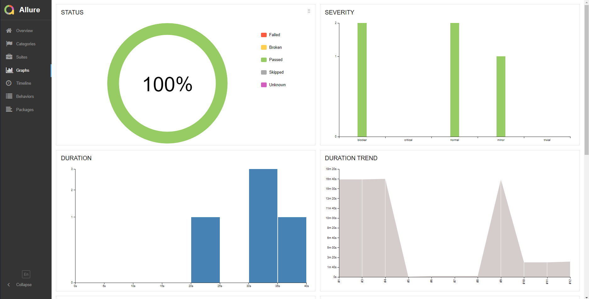
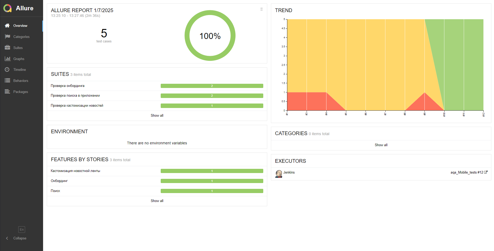
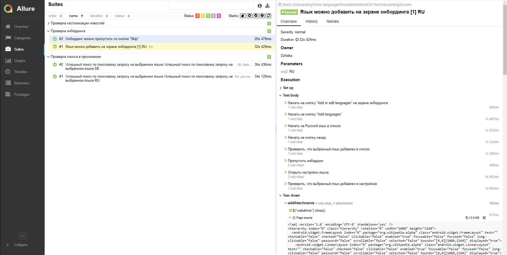
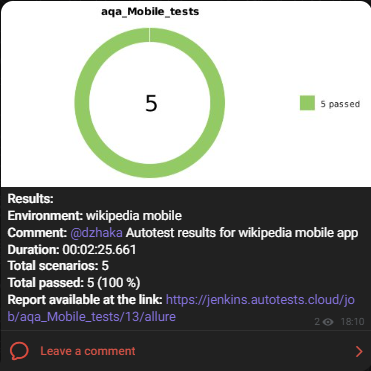

# Проект по автоматизации тестирования мобильного приложения [Wikipedia](https://www.wikipedia.org/)
<p align="center"><a href="https://www.wikipedia.org/"></a></p>

## Содержание:

- [Технологии и инструменты](#tools)
- [Тестовое покрытие](#cases)
- [Локальный запуск тестов](#localrun)
- [Запуск тестов в Jenkins](#remoterun)
- [Allure отчёт](#report)
- [Уведомления в Telegram](#telegram)
- [Видео с примером запуска тестов в Browserstack](#video)


<a id="tools"></a>

## Технологии и инструменты:

<div align="center">
<a href="https://www.jetbrains.com/idea/"></a>
<a href="https://github.com/"></a>  
<a href="https://www.java.com/"></a>
<a href="https://gradle.org/"></a>  
<a href="https://junit.org/junit5/"></a>
<a href="https://selenide.org/"></a>
<a href="https://rest-assured.io/">  </a>
<a href="https://developer.android.com/studio">  </a> 
<a href="https://www.browserstack.com/">  </a>
<a href="https://appium.io/">  </a>
<a href="https://www.jenkins.io/"></a>
<a href="https://github.com/allure-framework/"></a>
<a href="https://telegram.org/"></a>
</div>

<p></p>

Автотесты для данного проекта написаны на <code>Java</code> с использованием фреймворка <code>Selenide</code> для <code>Android</code> приложения.

В качестве фреймворка для запуска тестов используется <code>Junit5</code>, а в качестве сборщика проекта - <code>Gradle</code>.

Для локального тестирования приложения на мобильных устройствах используется <code>Android Studio</code> и <code>Appium</code>. Для удаленного тестирования на различных платформах <code>Browserstack</code>.

Произведена настройка CI в <code>Jenkins</code>.

По результатам каждого тестового прогона создаётся <code>Allure</code> отчёт для визуализации результатов прогона.

После прогона тестов <code>Telegram</code> бот присылает сообщение с информацией о прошедшем прогоне

<a id="cases"></a>

## Тестовое покрытие:
### Кастомизация новостной ленты
🔎 Выключенный тип контента не должен отображаться на экране "Explore"

### Онбординг
🔎 Язык можно добавить на экране онбординга

🔎 Онбординг можно пропустить по кнопке "Skip"

### Поиск
🔎 Успешный поиск по поисковому запросу

<a id="localrun"></a>

##  Локальный запуск тестов
Для локального запуска тестов из IDE или из терминала необходимо выполнить следующую команду

```
gradle clean test -DdeviceHost=local
```

> Для запуска локальных тестов на компьютере должны быть установлены Android Studio, Appium Server и Appium ([инструкция](https://autotest.how/appium-setup-for-local-android-tutorial))

<a id="remoterun"></a>

## <a href="https://www.jenkins.io/"></a> Запуск тестов в [Jenkins](https://jenkins.autotests.cloud/job/aqa_Mobile_tests/)
Для запуска тестов в Jenkins нужно нажать на кнопку Build Now в соответствующей сборке

<p align="center">

</p>

<a id="report"></a>

## <a href="https://github.com/allure-framework/"></a> [Allure отчёт](https://jenkins.autotests.cloud/job/aqa_Mobile_tests/12/allure/)
### Графики

<p align="center">

</p>

### Тесты

<p align="center">

</p>

<a id="telegram"></a>

## <a href="https://telegram.org/"></a> Уведомление в Telegram

По результатам каждого прогона тестов в Jenkins отправляется сообщение в Telegram. Сообщение содержит информацию о прогоне, а также диаграмму со статистикой прохождения тестов.

<p align="center">

</p>

<a id="video"></a>

## <a href="https://www.browserstack.com/">  </a> Видео с примером запуска тестов в Browserstack
В Allure отчёте к каждому тесту прикладываются скриншот с последнего шага, и видео прохождения теста. Примеры таких видео:

<p align="center">

</p>
